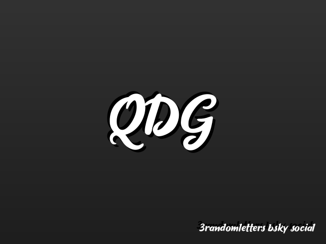
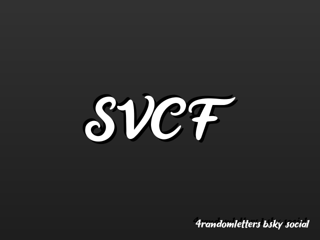
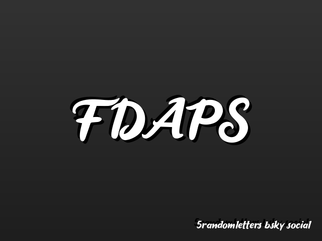

# 3rl

**3rl** stands for **3 Random Letters**. This repository is a simple automation that pushes an image containing a specified set of random letters (three, four, or five) to Bluesky accounts approximately three times every hour.

---

## What It Does

Every few minutes, the system:
- Generates an image featuring a random combination of letters (either three, four, or five characters long).
- Pushes this image to the corresponding Bluesky account.

This lightweight process keeps the profiles fresh with a new, randomized image throughout the day.

---

## Where to See It

Check out the Bluesky profiles where this automation is active:
- [3 Random Letters](https://bsky.app/profile/3randomletters.bsky.social)
- [4 Random Letters](https://bsky.app/profile/4randomletters.bsky.social)
- [5 Random Letters](https://bsky.app/profile/fiverandomletters.bsky.social)
- [My Profile](https://bsky.app/profile/hutlaw.xyz)

---

## Why 3rl?

I built 3rl as a fun and straightforward project to experiment with automation and design... and cause the accounts from Twitter seemed to do well. 

---

## Feedback and Contributions

If you have any suggestions, feedback, or ideas for improvements, feel free to open an issue or drop me a message. Your input is always welcome!

Happy coding!

— **Hutlaw**

Current 3 random letters

Current 4 random letters

Current 5 random letters

